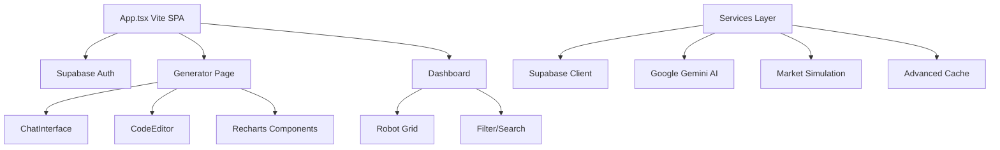

# Consolidated Implementation Guide - QuantForge AI
**Last Updated**: 2025-12-19 | **Target**: AI Agent Context Efficiency

## Quick Reference Architecture



## Core Technology Stack
- **Framework**: Vite + React 18 + TypeScript
- **DB/Backend**: Supabase (PostgreSQL + Realtime + Auth)
- **AI**: Google Gemini (gemini-3-pro-preview)
- **Charts**: Recharts (dynamically loaded)
- **Deployment**: Vercel Edge Functions
- **Language**: TypeScript (strict mode)

## Critical Build Compatibility Rules

### ❌ AVOID - Node.js Modules in Frontend
```typescript
// WRONG - Will break browser build
import { createHash } from 'crypto';
import { readFileSync } from 'fs';
import { join } from 'path';
```

### ✅ USE - Browser-Compatible Alternatives
```typescript
// RIGHT - Browser compatible
import { DataRecord } from '../types'; // Use proper interfaces
// Use Web APIs or polyfills
```

### 📋 Deployment Configuration Checklist
- [ ] `vercel.json` uses minimal schema-compliant settings
- [ ] No `experimental`, `regions`, or `cache` properties
- [ ] Build passes locally before deployment
- [ ] All imports work in browser environment

## Performance Optimization Strategy

### Bundle Splitting Results (Post-Optimization)
```
✅ Large chunks optimized:
- react-dom-client: 173.96 kB (-3.4kB from 177.35kB)
- ai-index: 214.68 kB (better naming from ai-vendor-core)
- chart-vendor-light: 121.77 kB
- vendor-misc: 127.19 kB

✅ Granular splitting achieved:
- React: core, jsx, dom-client, dom-server, router
- AI: index, chat, models, embeddings, text, errors, config
- Charts: core, scales, shapes, axes, animations, utils
```

### Dynamic Import Patterns
```typescript
// ✅ For heavy libraries
const ChartComponents = lazy(() => import('./ChartComponents'));

// ✅ For conditional code
if (import.meta.env.DEV) {
  const { DevTools } = await import('./dev-tools');
}
```

## Service Architecture

### Core Services
- **`supabase.ts`**: DB adapter pattern with localStorage fallback
- **`gemini.ts`**: AI service with retry logic and prompt engineering
- **`marketData.ts`**: Market simulation with realistic noise
- **`cache/`**: Multi-layer caching with compression

### Data Flow
1. User input → Gemini AI → MQL5 code
2. Code generation ↔ Real-time syntax highlighting
3. Strategy analysis → Monte Carlo simulation
4. Auto-save to Supabase with conflict resolution

## Component Patterns

### Heavy Components (Lazy Loaded)
```typescript
// Generator page - code-centric view
const GeneratorComponents = lazy(() => import('./pages/Generator'));

// Chart components - split by functionality
const ChartComponents = lazy(() => import('./ChartComponents'));
```

### Memoization Strategy
```typescript
// Performance-critical components
export const ChatInterface = React.memo(ChatInterfaceImpl);
export const Dashboard = React.memo(DashboardImpl);
```

## Security Implementation

### Input Sanitization
```typescript
// XSS prevention
import DOMPurify from 'dompurify';
const cleanHtml = DOMPurify.sanitize(userInput);

// Filename sanitization for downloads
const safeFilename = filename.replace(/[^a-z0-9.-]/gi, '_');
```

### API Key Management
- All API keys server-side via environment variables
- No hardcoded credentials in client code
- Rate limiting with browser-compatible hashing

## Error Handling Patterns

### Type-Safe Error Handling
```typescript
// ✅ Replace `any` with proper types
try {
  const result = await apiCall();
  return result as ExpectedType;
} catch (error: unknown) {
  if (error instanceof Error) {
    logger.error('API call failed:', error.message);
  }
  throw new Error('Operation failed');
}
```

### User-Friendly Messages
```typescript
// Error boundary patterns
return (
  <div className="error-fallback">
    <h2>Something went wrong</h2>
    <p>{error.userMessage || 'Please try again'}</p>
  </div>
);
```

## Development Workflow

### Pre-Commit Checklist
- [ ] `npm run build` passes without errors
- [ ] `npm run typecheck` passes
- [ ] No new `any` types (use `unknown` with type guards)
- [ ] Console statements guarded by `import.meta.env.DEV`
- [ ] Bundle chunks under 150KB where possible

### Code Quality Standards
- TypeScript strict mode
- React components memoized for performance
- Service functions with proper error handling
- No unused imports/variables (prefix with `_` if intentional)

## Deployment Process

### Vercel Optimization
```
✅ Edge functions for better latency
✅ Automatic gzip compression
✅ Static asset optimization
✅ CDN caching headers
```

### Performance Monitoring
- Real-user metrics collection
- Core Web Vitals tracking
- Error monitoring with context
- Bundle analysis on each build

## Troubleshooting Guide

### Common Build Issues
1. **Browser crypto errors**: Replace Node.js modules with browser alternatives
2. **Vercel schema validation**: Use minimal vercel.json configuration
3. **Large bundle chunks**: Check vite.config.ts manual chunks
4. **TypeScript errors**: Ensure proper types, avoid `any`

### Performance Debugging
1. Use React DevTools Profiler for component performance
2. Check Network tab for chunk loading times
3. Monitor Core Web Vitals in production
4. Analyze bundle with `npm run build -- --analyze`

## Future Architecture Notes

### Planned Features
- [ ] Community sharing platform
- [ ] Multi-file MQL5 projects (.mqh includes)
- [ ] Direct MT5 integration (local Python bridge)
- [ ] Version control for strategy iterations

### Scalability Considerations
- Database pagination for large datasets
- Edge caching for global performance
- API request deduplication
- Memory management for long sessions

---

**AI Agent Usage**: This consolidated guide provides the essential context for understanding, maintaining, and extending the QuantForge AI codebase. Focus on the critical compatibility rules and performance patterns when making changes.