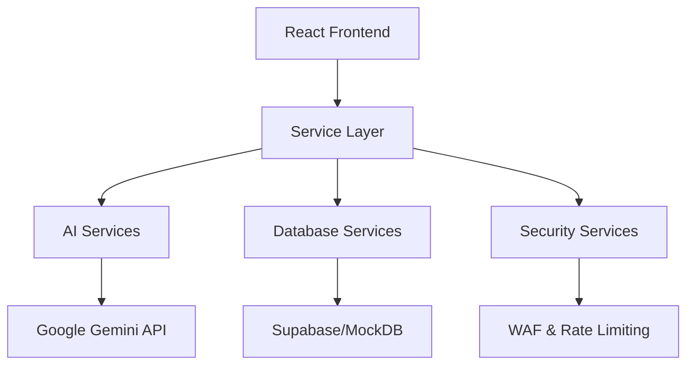

# Development Agent Context Guide

This document provides comprehensive context for AI agents working on the QuantForge AI codebase to ensure efficient and effective contributions.

## Project Overview

QuantForge AI is a sophisticated MQL5 trading robot generator that bridges natural language intent with compiled MQL5 code. The system follows enterprise-grade architecture patterns with strong emphasis on security, performance, and maintainability.

### Core Architecture



### Key Technical Principles

1. **Security First**: All data is validated, sanitized, and encrypted
2. **Performance Optimized**: Advanced edge computing and caching strategies
3. **Graceful Degradation**: Fallback mechanisms for every external dependency
4. **Modular Design**: Clear separation of concerns with service-oriented architecture

## Directory Structure & Responsibilities

### `/services/` - Core Business Logic
- **gemini.ts** (1141 lines): AI service integration with Google Gemini
- **supabase.ts** (1583 lines): Database operations with mock fallback
- **securityManager.ts** (1612 lines): Web Application Firewall and security utilities
- **edgeCacheManager.ts** (1209 lines): Advanced edge caching system

### `/components/` - React UI Components
- **ChatInterface.tsx**: AI conversation interface
- **CodeEditor.tsx**: MQL5 code editor with syntax highlighting
- **StrategyConfig.tsx**: Strategy parameter configuration
- **ChartComponents.tsx**: Analytics and visualization

### `/utils/` - Utility Functions
- **errorHandler.ts**: Centralized error management
- **enhancedRateLimit.ts**: Advanced rate limiting
- **performanceEnhanced.ts**: Performance monitoring
- **validationTypes.ts**: Input validation schemas

### `/constants/` - Configuration
- **config.ts**: Centralized configuration management
- **app.ts**: Application-wide constants
- **strategies/**: Strategy-specific configurations

## Critical Development Rules

### 1. Module Dependencies
```typescript
// ✅ Correct: Dynamic imports for heavy modules
const GoogleGenAI = await import('@google/genai');

// ❌ Incorrect: Static imports increase bundle size
import { GoogleGenAI } from '@google/genai';
```

### 2. Error Handling Pattern
```typescript
// ✅ Correct: Comprehensive error handling
try {
  const result = await operation();
  return result;
} catch (error) {
  handleError(error); // Centralized error handling
  return fallbackValue;
}
```

### 3. Security Validation
```typescript
// ✅ Correct: Always validate inputs
if (!securityManager.validateInput(userInput)) {
  throw new SecurityError('Invalid input detected');
}
```

### 4. Type Safety
```typescript
// ✅ Correct: Use specific types
interface StrategyParams {
  timeframe: string;
  riskPercent: number;
  // ... avoid 'any'
}

// ❌ Avoid: 'any' types
function process(data: any) { /* ... */ }
```

## Service Layer Patterns

### AI Service (gemini.ts)
- **Dynamic Loading**: Google GenAI SDK loaded on-demand
- **Rate Limiting**: Integrated with enhanced rate limiting
- **Retry Logic**: Exponential backoff for API failures
- **Caching**: Response caching for duplicate requests

### Database Service (supabase.ts)
- **Dual Mode**: Real Supabase + LocalStorage fallback
- **Connection Pooling**: Optimized database connections
- **Circuit Breaker**: Failure detection and recovery
- **Data Validation**: Schema validation on all operations

### Security Service (securityManager.ts)
- **WAF Protection**: 9 attack vector protections
- **Input Sanitization**: XSS and injection prevention
- **Rate Limiting**: Tier-based user limits
- **Encryption**: Secure data handling

## Testing Strategy

### Current Test Coverage
- **Edge Cache Manager**: 6 tests covering core functionality
- **Memory Management**: 6 tests for performance monitoring
- **Test Infrastructure**: Vitest + React Testing Library

### Test Categories
1. **Unit Tests**: Service layer functions
2. **Integration Tests**: Service interactions
3. **Component Tests**: React component behavior
4. **E2E Tests**: Full user workflows

### Test Patterns
```typescript
// ✅ Mock external dependencies
vi.mock('@google/genai', () => ({
  GoogleGenAI: vi.fn()
}));

// ✅ Clear mocks between tests
beforeEach(() => {
  vi.clearAllMocks();
});
```

## Build System

### Vite Configuration (vite.config.ts)
- **Advanced Chunking**: 646 lines of granular optimization
- **Edge Optimization**: Vercel Edge runtime support
- **Bundle Analysis**: Dynamic chunk splitting for performance
- **Tree Shaking**: Aggressive dead code elimination

### Build Performance
- **Build Time**: ~13.5 seconds
- **Bundle Chunks**: 22+ optimized chunks
- **Largest Chunks**: Chart vendor (208KB), AI vendor (214KB)
- **Cache Strategy**: Edge-optimized caching

## Code Quality Standards

### ESLint Configuration
- **Current Warnings**: 200+ (targets for reduction)
- **Priority Issues**: console.log statements, unused variables
- **Any Types**: 100+ instances (target: <50)

### Type Safety Goals
- **Current Score**: 70/100
- **Target**: 90/100 within 30 days
- **Focus Areas**: Service responses, error handling

## Deployment Architecture

### Vercel Edge Runtime
- **Global CDN**: Edge functions caching
- **Regional Deployment**: Automatic region affinity
- **Performance Monitoring**: Real-time metrics collection
- **Error Tracking**: Comprehensive error reporting

### Build Pipeline
1. **Type Check**: TypeScript compilation
2. **Lint**: Code quality validation
3. **Build**: Production optimization
4. **Deploy**: Edge deployment with warm-up

## Development Workflow

### Before Starting Work
1. **Check Current Branch**: Ensure on `develop` branch
2. **Review Documentation**: Read `AGENTS.md` and `blueprint.md`
3. **Run Build**: Verify `npm run build` passes
4. **Check Tests**: Ensure `npm run test:run` passes

### During Development
1. **Incremental Changes**: Small, focused commits
2. **Type Safety**: Strict typing for new code
3. **Error Handling**: Comprehensive error management
4. **Performance**: Monitor bundle size impact

### Before Committing
1. **Build Verification**: `npm run build`
2. **Type Checking**: `npm run typecheck`
3. **Testing**: `npm run test:run`
4. **Lint**: `npm run lint:fix`

## Common Patterns

### Configuration Access
```typescript
// ✅ Correct: Use centralized config
import { AI_CONFIG } from '../constants/config';

// ❌ Incorrect: Hardcoded values
const timeout = 5000;
```

### Service Communication
```typescript
// ✅ Correct: Service abstraction
const result = await supabaseService.createRobot(robotData);

// ❌ Incorrect: Direct dependency
const client = createSupabaseClient();
await client.from('robots').insert(robotData);
```

### Error Management
```typescript
// ✅ Correct: Centralized error handling
handleError(error, context);

// ❌ Incorrect: Direct console logging
console.error('Error:', error);
```

## Critical Dependencies

### External APIs
- **Google Gemini AI**: AI code generation
- **Supabase**: Database and authentication
- **Vercel Edge**: Global edge deployment

### Internal Dependencies
- **Security Manager**: All security validations
- **Rate Limiter**: API protection
- **Performance Monitor**: System optimization

## Troubleshooting Guide

### Common Issues
1. **Build Failures**: Check TypeScript compilation
2. **Bundle Size**: Review large chunks >100KB
3. **Type Errors**: Address `any` type usage
4. **Test Failures**: Mock configuration issues

### Debug Patterns
```typescript
// Use scoped logger for debugging
const logger = createScopedLogger('serviceName');
logger.debug('Debug message', { context });
```

## Future Development Focus

### Immediate Priorities (Week 1-2)
1. **Type Safety**: Reduce `any` types by 50%
2. **Test Coverage**: Implement comprehensive service tests
3. **Code Quality**: Address critical ESLint warnings

### Medium-term Goals (Month 1-2)
1. **Service Decomposition**: Break down monolithic services
2. **Performance**: Optimize bundle chunks further
3. **Documentation**: API docs from TypeScript

### Long-term Vision (Quarter 1)
1. **Enterprise Features**: Advanced monitoring and analytics
2. **Scalability**: Horizontal scaling preparations
3. **AI Enhancement**: Multi-provider AI services

This guide serves as the primary context foundation for AI agents working on QuantForge AI development tasks.