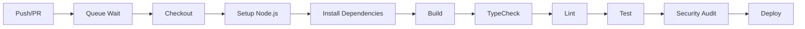

# DevOps Infrastructure Documentation

> **Last Updated**: 2026-02-23  
> **Maintainer**: DevOps Engineer Agent  
> **Status**: Production Ready

## Overview

This document describes the DevOps infrastructure, CI/CD pipelines, deployment configurations, and operational procedures for the QuantForge AI application.

## Table of Contents

1. [Architecture Overview](#architecture-overview)
2. [CI/CD Pipelines](#cicd-pipelines)
3. [Deployment Platforms](#deployment-platforms)
4. [Environment Configuration](#environment-configuration)
5. [Monitoring & Observability](#monitoring--observability)
6. [Security Configuration](#security-configuration)
7. [Operational Procedures](#operational-procedures)
8. [Troubleshooting Guide](#troubleshooting-guide)

---

## Architecture Overview

### Technology Stack

| Component | Technology | Version |
|-----------|------------|---------|
| Frontend | React 19 | Latest |
| Build Tool | Vite | 5.x |
| Runtime | Node.js | 20.x |
| Package Manager | npm | 10.x |
| Type System | TypeScript | 5.x |

### Deployment Targets

| Platform | Purpose | Status |
|----------|---------|--------|
| Vercel | Primary Production | ✅ Active |
| Cloudflare Workers | Edge Deployment | ⚠️ Issues (#1096) |

---

## CI/CD Pipelines

### Workflow Files

| Workflow | File | Trigger | Purpose |
|----------|------|---------|---------|
| on-push | `.github/workflows/on-push.yml` | Push to main | Main automation workflow |
| on-pull | `.github/workflows/on-pull.yml` | PR events | PR validation and processing |
| parallel | `.github/workflows/parallel.yml` | Manual | Parallel execution |
| iterate | `.github/workflows/iterate.yml` | Manual | Iteration workflow |
| workflow-monitor | `.github/workflows/workflow-monitor.yml` | Schedule | Workflow monitoring |

### Pipeline Stages



### Quality Gates

All PRs must pass the following quality gates before merge:

| Check | Command | Threshold |
|-------|---------|-----------|
| Build | `npm run build` | Success |
| TypeScript | `npm run typecheck` | 0 errors |
| Lint | `npm run lint` | 0 errors |
| Tests | `npm run test:run` | 100% pass |
| Security | `npm audit` | No high/critical |

### Caching Strategy

```yaml
# Cache configuration
- path: |
    ~/.opencode
    ~/.npm
  key: opencode-${{ runner.os }}-${{ hashFiles('**/package-lock.json') }}-v1
```

---

## Deployment Platforms

### Vercel Configuration

**File**: `vercel.json`

```json
{
  "version": 2,
  "buildCommand": "npm ci --prefer-offline --no-audit && npm run build",
  "outputDirectory": "dist",
  "installCommand": "npm ci --prefer-offline --no-audit"
}
```

**Features**:
- SPA routing with rewrites
- Comprehensive security headers
- HSTS enabled
- CSP configured

**Security Headers**:
- `X-Content-Type-Options: nosniff`
- `X-Frame-Options: DENY`
- `Strict-Transport-Security: max-age=31536000`
- Content-Security-Policy configured
- Permissions-Policy restricted

### Cloudflare Workers

**Status**: ⚠️ Configuration Issues

**Known Issues**:
- #1096: Cloudflare Workers build failure
- #896: Environment variables cleanup needed

**Resolution**: Requires admin action in Cloudflare dashboard

---

## Environment Configuration

### Required Secrets

| Secret | Description | Used By |
|--------|-------------|---------|
| `VITE_SUPABASE_URL` | Supabase project URL | Build, Runtime |
| `VITE_SUPABASE_ANON_KEY` | Supabase anonymous key | Build, Runtime |
| `GEMINI_API_KEY` | Google Gemini API key | Build, Runtime |
| `GITHUB_TOKEN` | GitHub API token | CI/CD |
| `IFLOW_API_KEY` | iFlow API key | CI/CD |

### Environment Variables (Deprecated)

The following variables are deprecated and should be removed:
- ~~`VITE_SUPABASE_KEY`~~ → Use `VITE_SUPABASE_ANON_KEY`
- ~~`CLOUDFLARE_ACCOUNT_ID`~~ → Configure in Cloudflare dashboard
- ~~`CLOUDFLARE_API_TOKEN`~~ → Configure in Cloudflare dashboard

### Local Development

```bash
# Copy example environment
cp .env.example .env.local

# Required variables
VITE_API_KEY=your_gemini_api_key
VITE_SUPABASE_URL=your_supabase_url
VITE_SUPABASE_ANON_KEY=your_supabase_anon_key
```

---

## Monitoring & Observability

### DevOps Health Monitoring

**Script**: `scripts/devops-health-monitor.ts`

Monitors:
- Build system health
- Code quality (lint, tests)
- Security posture
- CI/CD pipeline status
- Repository hygiene
- Dependencies health

**Usage**:
```bash
npx ts-node scripts/devops-health-monitor.ts
```

### Deployment Status Tracking

**Script**: `scripts/deployment-status-tracker.ts`

Tracks:
- Vercel deployment status
- Cloudflare Workers status
- Build artifacts status

**Usage**:
```bash
npx ts-node scripts/deployment-status-tracker.ts
```

### Bundle Size Monitoring

**Script**: `scripts/bundle-size-monitor.js`

Monitors bundle sizes and warns about large chunks.

**Usage**:
```bash
node scripts/bundle-size-monitor.js
```

---

## Security Configuration

### Security Headers (Vercel)

All responses include:
- Content-Security-Policy
- Strict-Transport-Security
- X-Frame-Options: DENY
- X-Content-Type-Options: nosniff
- Permissions-Policy (restricted)

### CSP Configuration

```
default-src 'self';
script-src 'self' https://www.googletagmanager.com https://www.google-analytics.com;
style-src 'self' 'unsafe-inline' https://fonts.googleapis.com;
font-src 'self' data: https://fonts.gstatic.com;
img-src 'self' data: https: blob:;
connect-src 'self' https://api.supabase.co https://*.supabase.co https://www.googleapis.com https://generativelanguage.googleapis.com wss://ws.twelvedata.com;
object-src 'none';
frame-src 'none';
```

### Security Best Practices

1. **No hardcoded secrets** - All secrets via environment variables
2. **Dependency auditing** - Automated npm audit in CI
3. **XSS protection** - DOMPurify for user input
4. **SQL injection protection** - Parameterized queries via Supabase
5. **CSRF protection** - Built into Supabase auth

---

## Operational Procedures

### Deployment Process

1. **Pre-deployment**:
   ```bash
   npm run build
   npm run typecheck
   npm run lint
   npm run test:run
   npm audit --audit-level=moderate
   ```

2. **Deploy to Vercel**:
   ```bash
   vercel --prod
   ```

3. **Post-deployment**:
   - Verify deployment URL
   - Check health endpoints
   - Monitor error rates

### Rollback Procedure

1. **Vercel Dashboard**:
   - Go to Deployments
   - Select previous successful deployment
   - Click "Promote to Production"

2. **CLI Rollback**:
   ```bash
   vercel rollback
   ```

### Branch Cleanup

Stale branches (>14 days old, merged) should be cleaned up:

```bash
# List stale branches
git branch -r --merged main | grep -v main | head

# Delete remote branch
git push origin --delete branch-name
```

---

## Troubleshooting Guide

### Common Issues

#### Build Fails

**Symptom**: Build fails with TypeScript errors

**Solution**:
```bash
# Clear cache
rm -rf node_modules .vite dist
npm install
npm run build
```

#### Cloudflare Workers Failure

**Symptom**: "Workers Builds: quanforge" check fails

**Known Issue**: #1096

**Workaround**: 
1. Merge PR anyway (Vercel will deploy)
2. Cloudflare requires dashboard configuration

#### Vercel Deployment Pending

**Symptom**: Vercel preview not generating

**Solution**:
1. Check Vercel dashboard for build logs
2. Verify all environment variables are set
3. Check for build timeouts

### Debug Commands

```bash
# Check build locally
npm run build

# Run all quality gates
npm run typecheck && npm run lint && npm run test:run

# Check for security issues
npm audit

# Monitor bundle sizes
npm run build:analyze
```

---

## DevOps Scripts Reference

| Script | Purpose |
|--------|---------|
| `devops-health-monitor.ts` | Comprehensive health check |
| `deployment-status-tracker.ts` | Deployment status |
| `bundle-size-monitor.js` | Bundle size monitoring |
| `check-bundle-size.cjs` | Bundle size check |
| `devops-health-check.sh` | Shell-based health check |
| `apply-ci-workflow-fixes.sh` | CI workflow fixes |

---

## Related Issues

| Issue | Priority | Status | Description |
|-------|----------|--------|-------------|
| #1096 | P1 | Open | Cloudflare Workers build failure |
| #1029 | P1 | Open | CI Environment Variable Regression |
| #896 | P3 | Open | Cloudflare env vars cleanup |
| #895 | P2 | Open | Stale Protected develop Branch |
| #556 | P3 | Open | CI/DevOps Hygiene Improvements |

---

## Contact

For DevOps-related issues:
1. Check this documentation
2. Review open issues
3. Create new issue with `devops-engineer` label
